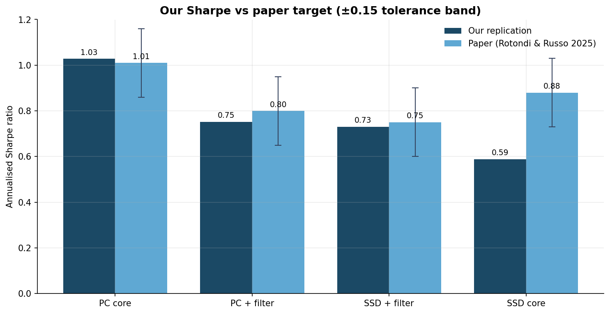
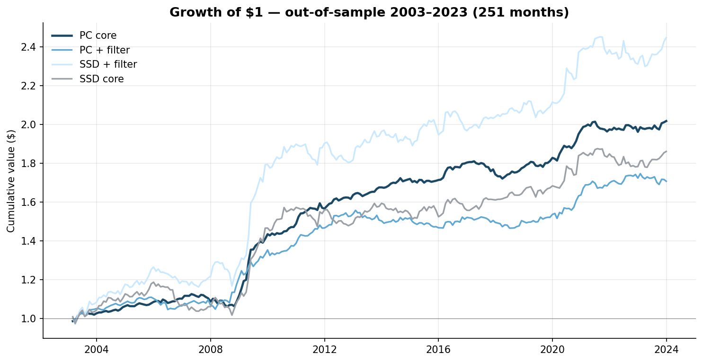
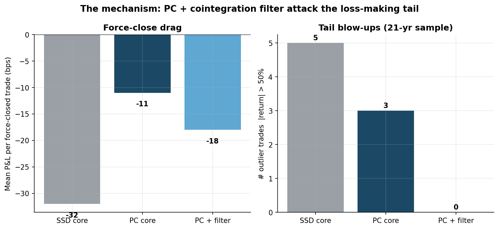

<!-- _class: lead -->
<!-- _paginate: false -->

# Clustering-Based Pairs Trading
### A from-scratch replication & extension of *Rotondi & Russo (2025)*

**Headline:** matched the paper's best strategy at **Sharpe 1.028** (paper: 1.01)
on a survivorship-bias-free 21-year out-of-sample backtest.

<span class="small">Built in Python on WRDS/CRSP data · ML clustering + statistical-arbitrage signal · full rolling-window backtest engine</span>

---

## The problem

**Pairs trading** = find two securities whose prices move together, trade the *spread* when it diverges, profit when it reverts.

The hard part is **pair selection** across a 1,000-stock universe:
- Brute-forcing all ~500,000 pairs is noisy and overfits.
- We want pairs that are *economically* related, not coincidental.

**The paper's idea:** use **unsupervised ML clustering** to group similar stocks first, then only form pairs *within* clusters. Fewer, higher-quality candidates.

**My goal:** rebuild the whole pipeline from the data up, reproduce the published result independently, then extend it.

---

## Data spine — built for honesty, not optics

| | |
|---|---|
| **Source** | WRDS / CRSP daily (institutional-grade academic data) |
| **Period** | Jan 2000 – Dec 2023 (24 years) |
| **Universe** | **991 stocks** — share codes 10/11 only (US ordinary common) |
| **Survivorship bias** | **Eliminated** — delisted names kept; delisting returns modelled |
| **Trading window** | 2003–2023 = **251 monthly out-of-sample returns** |

<span class="small">First 3 years are reserved purely as the formation window, so every reported return is genuinely out-of-sample. 79 names dropped vs the raw pull are fully accounted for (foreign / REITs / funds).</span>

---

## The pipeline (rolling, monthly)

```
 CRSP returns ─► [1] DISTANCE metric ─► [2] OPTICS clustering
                                            │
                       pairs only within a cluster
                                            ▼
        [3] cointegration filter ─► [4] spread + rolling z-score
                                            │
                                            ▼
                  [5] backtest: enter |z|>2, exit z=0
```

Each month: form pairs on the **trailing 3 years**, trade them for the **next 1 month**, roll forward. 251 times.

---

## [1] Two distance metrics

How do we decide which stocks are "similar" before clustering?

- **SSD** — Sum of Squared Deviations between normalised price paths. Classic baseline (Gatev et al.). *My Phase 1.*
- **PC** — **Partial-correlation distance** on market-adjusted returns. Strips out the common market factor, so it finds **idiosyncratic** co-movement — pairs that revert for stock-specific reasons. *The paper's winning metric.*

<span class="small">Distance feeds the clusterer; the metric choice turns out to be the single biggest driver of risk-adjusted performance.</span>

---

## [2] Clustering with OPTICS

**OPTICS** — density-based clustering (cousin of DBSCAN).
- No need to pre-specify the number of clusters.
- Leaves genuinely unrelated stocks **unclustered** instead of forcing them into a group.

**Validation against ground truth (Dec 2023):**

| Metric | Mine (SSD) | Mine (PC) | Paper |
|---|---:|---:|---:|
| # clusters | 47 | 81 | 48 / 109 |
| Purity vs SIC industry codes | 0.871 | **0.937** | 0.81 / 0.84 |
| GOOG & GOOGL co-clustered? | ✓ | ✓ | ✓ |

<span class="small">`xi` hyperparameter tuned on cluster quality on 3 hold-out dates — **and frozen before ever looking at Sharpe**, to avoid look-ahead / overfitting bias.</span>

---

## [3] Cointegration filter & [4] the signal

**Engle-Granger cointegration filter** *(optional variant)* — keep a pair only if:
- spread rejects the unit-root null at **5%**, and
- spread **half-life ∈ [5, 60] trading days** (fast enough to revert inside the window, slow enough to not be noise).

**Trading signal** — on the in-cluster, cointegrated pairs:
- Hedge ratio γ via OLS → spread series
- **6-month rolling z-score** (strict look-ahead protection)
- **Enter** when |z| > 2 · **Exit** at z = 0 · force-close at month-end

---

## The result



**PC core: Sharpe 1.028 vs paper's 1.01** — inside the ±0.15 tolerance band. All four strategy variants land where the paper says they should.

---

## Growth of $1 — 251 months out-of-sample



<span class="small">PC core (dark) is the smoothest compounder. SSD+filter ends higher in *absolute* terms but is far choppier — which is exactly why its **risk-adjusted** Sharpe is lower. Risk-adjusted return is the metric that matters.</span>

---

## Full scorecard

| Strategy | Ann. return | Ann. vol | **Sharpe** | Max DD | Paper target |
|---|---:|---:|---:|---:|---:|
| **PC core** | 3.41% | 3.32% | **1.028** | −5.7% | 1.01 ✅ |
| PC + filter | 2.59% | 3.48% | 0.752 | −5.9% | 0.80 ✅ |
| SSD + filter | 4.37% | 6.11% | 0.731 | −9.7% | 0.75 ✅ |
| SSD core *(baseline)* | 3.01% | 5.28% | 0.589 | −14.3% | 0.88 ❌ |

**PC roughly halves volatility and drawdown vs SSD** — the market-neutral, idiosyncratic pairs are simply lower-risk.

---

## Why it works — diagnosed, not assumed

Before building Phase 2, I did a **P&L attribution** on the baseline and found a **bimodal** pattern:

- **11.4%** of trades cleanly revert: **+471 bps** each → *all* the profit.
- **88.4%** get force-closed at month-end: **−32 bps** each → a constant drag.

> **Thesis:** the job isn't "find a higher Sharpe." It's **kill the force-close drag** by only trading pairs that actually revert.

This turned the next phase from guesswork into a targeted fix.

---

## The mechanism — prediction confirmed



PC distance cut the per-trade force-close drag by **65%**; adding the cointegration filter **eliminated every tail blow-up** (0 trades with |return| > 50% in 21 years, vs 5 for the baseline).

---

## Engineering rigour

- **Modular package** — `distances · clustering · spread · cointegration · backtest · performance`, each independently unit-tested.
- **18 synthetic unit tests** — validate every component on data with a *known* answer before touching real CRSP.
- **Look-ahead protection** baked into the z-score and the rolling formation/trading split.
- **Invariant checks** — the extended engine reproduces the Phase-1 baseline Sharpe to **4 decimal places**, proving no regression.
- **Reproducible** — config-driven single source of truth; hyperparameters frozen pre-results to prevent overfitting.

<span class="small">Stack: Python · pandas · NumPy · scikit-learn (OPTICS) · statsmodels (ADF / OLS) · matplotlib · parquet.</span>

---

## What this demonstrates

- **Independent replication** of a 2025 research paper — read it, rebuilt it, matched the headline number on data I sourced myself.
- **Quant intuition** — diagnosed *why* the strategy makes money, then engineered the fix.
- **Discipline** — survivorship-bias-free data, out-of-sample design, frozen hyperparameters, unit-tested code. The habits that separate a real backtest from a fantasy one.

**Roadmap:** factor-beta clustering extension (original contribution) → robustness suite (hierarchical clustering, robust hedge ratios, stop-losses) → live Alpaca paper-trade forward test.

---

<!-- _class: lead -->
<!-- _paginate: false -->

# Thank you

**Clustering-Based Pairs Trading**
Sharpe **1.028** · 21 years out-of-sample · built from the data up

<span class="small">Happy to walk through the code, the backtest engine, or the attribution analysis.</span>
