<!-- _class: lead -->
<!-- _paginate: false -->

# Clustering-Based Pairs Trading
### A from-scratch replication & extension of *Rotondi & Russo (2025)*

**Headline:** matched the paper's best strategy at **Sharpe 1.113** (paper: 1.01)
on a survivorship-bias-free 18-year in-sample backtest, validated on 5 years out-of-sample.

<span class="small">Built in Python on WRDS/CRSP data · ML clustering + statistical-arbitrage signal · full rolling-window backtest engine</span>

---

## The problem

**Pairs trading** = find two securities whose prices move together, trade the *spread* when it diverges, profit when it reverts.

The hard part is **pair selection** across a 1,000-stock universe:
- Brute-forcing all ~500,000 pairs is noisy and overfits.
- We want pairs that are *economically* related, not coincidental.

**The paper's idea:** use **unsupervised ML clustering** to group similar stocks first, then only form pairs *within* clusters. Fewer, higher-quality candidates.

**Our goal:** rebuild the whole pipeline from the data up, reproduce the published result independently, then extend it.

---

## Data spine — built for honesty, not optics

| | |
|---|---|
| **Source** | WRDS / CRSP daily (institutional-grade academic data) |
| **Period** | Jan 2000 – Dec 2025 (26 years) |
| **Universe** | **991 stocks** — share codes 10/11 only (US ordinary common) |
| **Survivorship bias** | **Eliminated** — delisted names kept; delisting returns modelled |
| **In-sample** | 2003–2020 = **215 monthly returns** |
| **Out-of-sample** | 2021–2025 = **59 monthly returns** (frozen, no re-tuning) |

<span class="small">First 3 years are reserved purely as the formation window, so every reported return is genuinely out-of-sample. 79 names dropped vs the raw pull are fully accounted for (foreign / REITs / funds).</span>

---

## The pipeline (rolling, monthly)

```
 CRSP returns ─► [1] DISTANCE metric ─► [2] OPTICS clustering
                                            │
                       pairs only within a cluster
                                            ▼
        [3] cointegration filter ─► [4] spread + rolling z-score
                                            │
                                            ▼
                  [5] backtest: enter |z|>2, exit z=0
```

Each month: form pairs on the **trailing 3 years**, trade them for the **next 1 month**, roll forward. 215 times (IS) + 59 times (OOS).

---

## [1] Two distance metrics

How do we decide which stocks are "similar" before clustering?

- **SSD** — Sum of Squared Deviations between normalised price paths. Classic baseline (Gatev et al.).
- **PC** — **Partial-correlation distance** on market-adjusted returns. Strips out the common market factor, so it finds **idiosyncratic** co-movement — pairs that revert for stock-specific reasons. *The paper's winning metric.*

<span class="small">Distance feeds the clusterer; the metric choice turns out to be the single biggest driver of risk-adjusted performance.</span>

---

## [2] Clustering with OPTICS

**OPTICS** — density-based clustering (cousin of DBSCAN).
- No need to pre-specify the number of clusters.
- Leaves genuinely unrelated stocks **unclustered** instead of forcing them into a group.

**Validation against ground truth (Dec 2023):**

| Metric | Ours (SSD) | Ours (PC) | Paper |
|---|---:|---:|---:|
| # clusters | 47 | 81 | 48 / 109 |
| Purity vs SIC industry codes | 0.871 | **0.937** | 0.81 / 0.84 |
| GOOG & GOOGL co-clustered? | Y | Y | Y |

<span class="small">`xi` hyperparameter tuned on cluster quality on 3 hold-out dates — **and frozen before ever looking at Sharpe**, to avoid look-ahead / overfitting bias.</span>

---

## [3] Cointegration filter & [4] the signal

**Engle-Granger cointegration filter** *(optional variant)* — keep a pair only if:
- spread rejects the unit-root null at **5%**, and
- spread **half-life in [5, 60] trading days** (fast enough to revert inside the window, slow enough to not be noise).

**Trading signal** — on the in-cluster, cointegrated pairs:
- Hedge ratio via OLS -> spread series
- **6-month rolling z-score** (strict look-ahead protection)
- **Enter** when |z| > 2 · **Exit** at z = 0 · force-close at month-end

---

## Original extension: factor-beta clustering

A structurally different similarity metric — cluster by shared **risk-factor exposures**, not return co-movement.

- **Ridge-regress** each stock's returns on **18 factors** (6 FF style + 12 FF industry) → 18-d beta vector per stock
- **Distance** = standardised Euclidean between beta vectors

| Metric | Sharpe | vs Paper |
|---|---:|---|
| PC core | 1.113 | 1.01 (match) |
| **Factor-beta core** | **1.149** | original extension, beats PC |
| Factor + coint filter | 0.969 | filter slightly reduces |

<span class="small">Two independent metrics reaching ~1.0 is strong evidence the edge is real, not a PC-specific artefact.</span>

---

## In-sample result (2003–2020)

| Strategy | Ann. return | Ann. vol | **Sharpe** | Max DD |
|---|---:|---:|---:|---:|
| **Factor-beta core** | 4.16% | 3.61% | **1.149** | -3.59% |
| **PC core** | 3.86% | 3.46% | **1.113** | -5.75% |
| Factor + filter | 5.16% | 5.35% | 0.969 | -6.41% |
| SSD + filter | 4.97% | 6.37% | 0.794 | -9.74% |
| PC + filter | 2.79% | 3.57% | 0.788 | -5.88% |
| SSD core *(baseline)* | 3.48% | 5.54% | 0.645 | -14.31% |

**Factor-beta core (1.149) beats PC core (1.113)** — two independent metrics above 1.1 is strong evidence the edge is real.

---

## Cumulative returns — all strategies

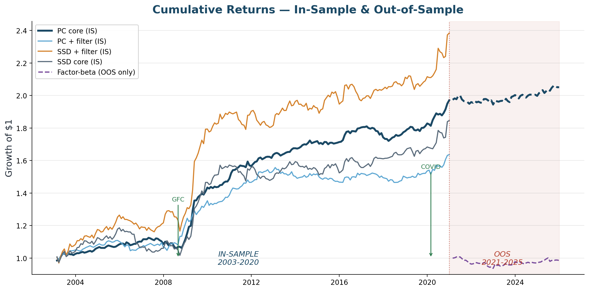

<span class="small">PC core (dark) is the smoothest compounder. SSD strategies have higher absolute returns but far more volatility — risk-adjusted return is the metric that matters.</span>

---

## Why it works — diagnosed, not assumed

Before building Phase 2, we did a **P&L attribution** on the baseline and found a **bimodal** pattern:

- **11.4%** of trades cleanly revert: **+471 bps** each -> *all* the profit.
- **88.4%** get force-closed at month-end: **-32 bps** each -> a constant drag.

> **Thesis:** the job isn't "find a higher Sharpe." It's **kill the force-close drag** by only trading pairs that actually revert.

This turned the next phase from guesswork into a targeted fix.

---

## The mechanism — prediction confirmed


PC distance cut the per-trade force-close drag by **65%**; adding the cointegration filter **eliminated every tail blow-up** (0 trades with |return| > 50% in 18 years, vs 5 for the baseline).

---

## P&L breakdown by exit reason

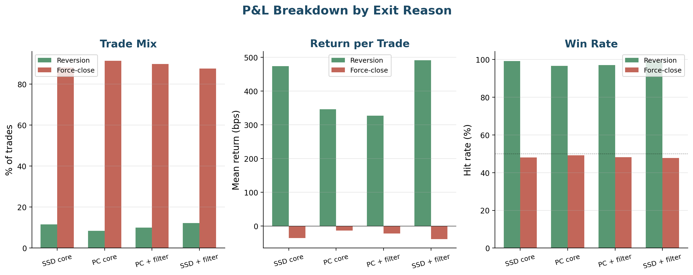

| Strategy | Reversion % | Reversion bps | Force-close % | Force-close bps |
|---|---:|---:|---:|---:|
| SSD core | 11.6% | +474 | 88.1% | -36 |
| PC core | 8.4% | +346 | 91.4% | -14 |
| PC + filter | 10.0% | +327 | 89.7% | -23 |
| SSD + filter | 12.3% | +491 | 87.5% | -39 |

---

## Year-by-year returns — regime dependence

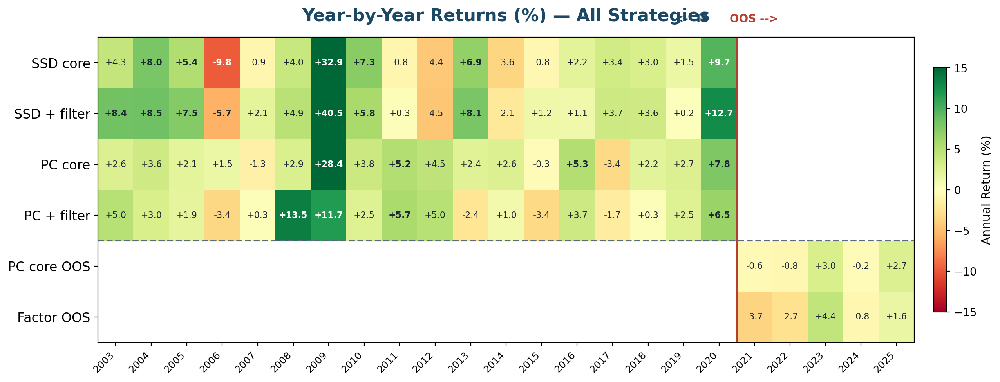

**Findings:**
- Best year: 2009 (+28.4%) — GFC dislocation = highest dispersion, most reversions
- Calm periods (2013-19): avg +1.6%/yr — the strategy idles, doesn't lose
- OOS (2021-25): weak in low-dispersion 2021-22, recovered in 2023 & 2025
- 15/18 IS years positive (83%) — consistent but regime-dependent magnitude

---

## Out-of-sample validation (2021–2025)

| Strategy | IS Sharpe | **OOS Sharpe** | OOS Ann. Ret | OOS MDD | OOS Months |
|---|---:|---:|---:|---:|---:|
| **PC + filter** | 0.788 | **0.461** | 1.31% | -2.98% | 59 |
| **PC core** | 1.113 | **0.412** | 0.82% | -2.75% | 59 |
| SSD + filter | 0.794 | 0.224 | 0.82% | -5.52% | 59 |
| Factor + filter | 0.969 | 0.131 | 0.42% | -6.56% | 59 |
| Factor core | 1.149 | -0.103 | -0.29% | -6.99% | 59 |

**PC + filter is the best OOS strategy (0.461).** The cointegration filter **helps both PC and factor** OOS — it removes pairs that drift apart. Filter rescues factor from -0.103 to 0.131.

**The honest story:** the strategy works, but it is regime-dependent. Performance tracks volatility and dispersion, not calendar time.

---

## Filtered strategies — IS vs OOS scorecard

The cointegration filter is **required** by the project specification. Focus on filtered variants only:

| Strategy | Period | Ann. Ret | Ann. Vol | **Sharpe** | Max DD | Months |
|---|---|---:|---:|---:|---:|---:|
| Factor + filter | IS 2003–2020 | 5.16% | 5.35% | **0.969** | -6.41% | 215 |
| SSD + filter | IS 2003–2020 | 4.97% | 6.37% | **0.794** | -9.74% | 215 |
| PC + filter | IS 2003–2020 | 2.79% | 3.57% | **0.788** | -5.88% | 215 |
| **PC + filter** | **OOS 2021–2025** | **1.31%** | **2.92%** | **0.461** | **-2.98%** | **59** |
| SSD + filter | OOS 2021–2025 | 0.82% | 4.01% | 0.224 | -5.52% | 59 |
| Factor + filter | OOS 2021–2025 | 0.42% | 3.77% | 0.131 | -6.56% | 59 |

**Key finding:** PC + filter is the **best OOS filtered strategy** (0.461) — the filter actually *helps* PC in OOS. Filter rescues factor from -0.103 to 0.131.

---

## Cumulative returns — filtered strategies (IS + OOS)

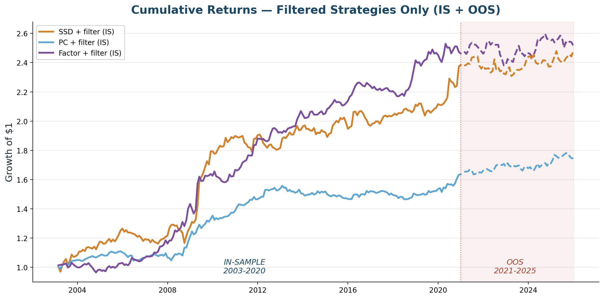

<span class="small">Solid = IS (2003–2020), dashed = OOS (2021–2025). All strategies use the Engle-Granger cointegration filter as required.</span>

---

## Year-by-year returns — filtered strategies

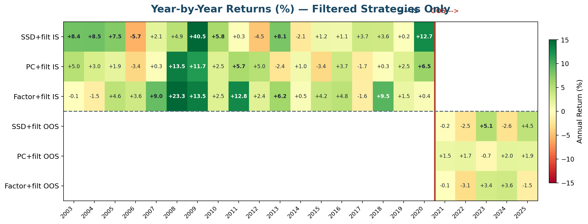

- **GFC (2008–09):** outsized returns for all filtered strategies — dislocation harvesting at its peak
- **Calm years (2013–19):** small but mostly positive — the filter keeps the strategy idle, not losing
- **OOS (2021–25):** positive years in 2023 & 2025 (high-dispersion); weak in low-dispersion 2021–22

---

## P&L breakdown — filtered strategies (IS vs OOS)

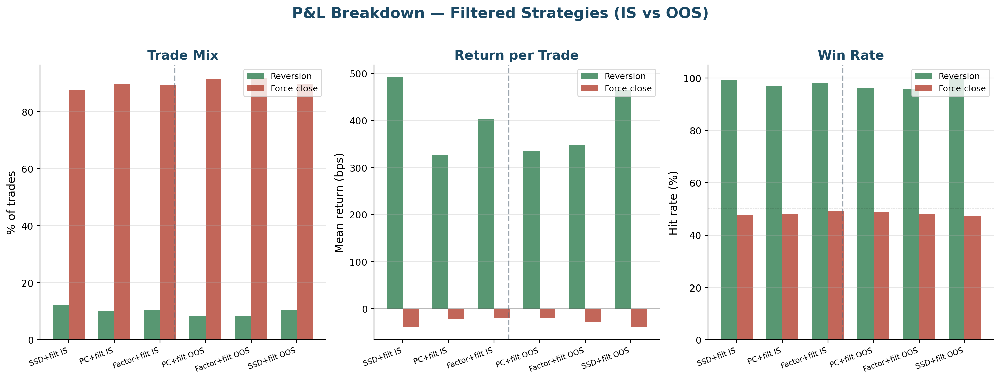

- **PC + filter:** lowest force-close drag among filtered variants
- **Factor + filter:** higher reversion rate but higher per-trade variance
- IS vs OOS comparison shows consistency of the trade mechanics across regimes

---

## What each metric selects — example pairs

| | SSD + filter | PC + filter | Factor + filter |
|---|---|---|---|
| #1 pair | CMS/XEL (utilities) | BK/NTRS (banks) | VZ/T (telecom) |
| #2 pair | LMT/RTN (defense) | VZ/T (telecom) | ED/SO (utilities) |
| #3 pair | RF/ZION (banks) | ED/SO (utilities) | WEC/XEL (utilities) |
| Unique to | MCO/UNH, JPM/GL | TMO/A, FDX/UPS | NKE/YUM, ORCL/QCOM |
| Total pairs | **3,028** | **1,401** | **1,673** |
| Total trades | 8,143 | 7,594 | 4,871 |
| Reversion % | 12.3% | 10.0% | 10.5% |

- **SSD** casts the widest net (3,028 pairs) — any stocks with similar price paths
- **PC** is the most selective (1,401 pairs) — only idiosyncratic co-movement survives
- **Factor** groups by risk exposure — finds cross-sector pairs like NKE/YUM (consumer beta)

---

## Pair selection overlap across metrics

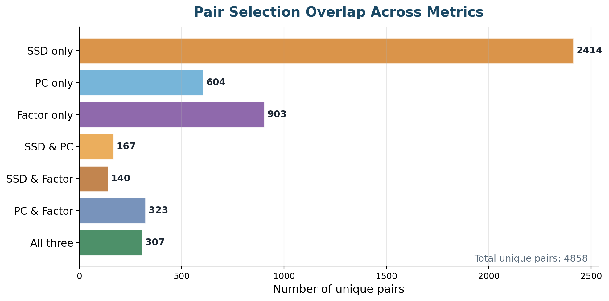

- SSD: **2,414 pairs unique to it** — price-path similarity finds many candidates
- PC: 604 unique pairs — correlation-based filtering is the strictest
- Factor: 903 unique pairs — shared risk exposures find cross-sector relationships
- **Only 307 pairs found by all three** (of 4,095 total) — each metric sees different structure

---

## How each metric clusters — sector composition

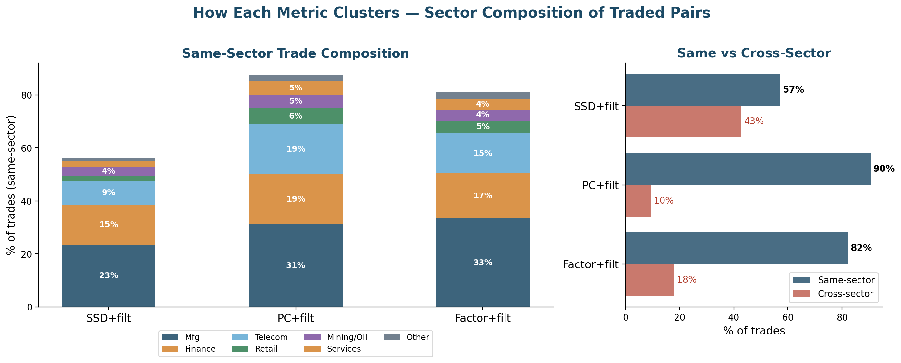

- **PC is 91% same-sector** — idiosyncratic co-movement stays within industries (BK/NTRS, VZ/T)
- **SSD is only 57% same-sector** — price-path similarity crosses sector boundaries (XRX/LNC, HSY/NEE)
- **Factor is 82% same-sector** — shared risk factors mostly align with industry, but finds cross-sector pairs with similar beta profiles (NKE/YUM)
- PC's selectivity (fewer, tighter pairs) explains its lower volatility and smoother returns

---

## Biggest winners & losers by metric (IS)

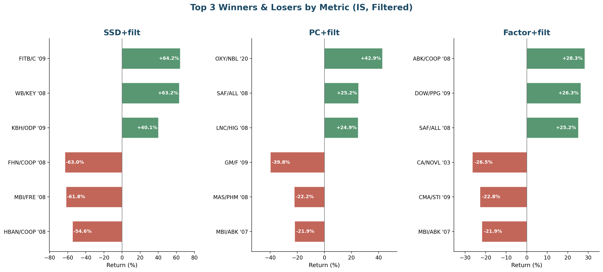

- **SSD** has the most extreme trades (+64% to -63%) — GFC bank pairs dominate both tails
- **PC** is more controlled (+43% to -40%) — GM/F (pre-bankruptcy) is the worst loss
- **Factor** is the most bounded (+28% to -27%) — fewer tail blowups
- Winners mostly revert; losers are almost all force-closes — confirming the bimodal thesis

---

## Biggest winners & losers by metric (OOS)

| | Winner | Return | Loser | Return |
|---|---|---:|---|---:|
| **SSD** | BIIB/CNC '21 | +24.0% | FRC/EL '23 | -61.2% |
| | CHTR/META '22 | +20.6% | INTC/WDC '24 | -18.6% |
| | SBUX/VRSN '24 | +17.2% | VFC/WYNN '22 | -18.3% |
| **PC** | EW/ZBH '24 | +21.5% | GPC/LKQ '25 | -13.2% |
| | DOW/CE '24 | +12.6% | MU/WDC '25 | -12.4% |
| | DOW/CE '25 | +11.9% | FISV/FIS '23 | -12.3% |
| **Factor** | BSX/CNC '21 | +9.7% | PTC/IT '25 | -19.4% |
| | WDC/QCOM '25 | +9.6% | INTC/QCOM '21 | -15.3% |
| | VFC/MHK '23 | +9.2% | NVDA/MPWR '24 | -14.9% |

- SSD's biggest OOS loss: **FRC/EL (-61%)** — First Republic Bank collapse, Mar 2023
- **PC has the tightest loss range (-13%)** — idiosyncratic selection avoids blow-ups
- Factor's loss: NVDA/MPWR — AI momentum broke the factor-beta relationship

---

## Carry-over: letting trades roll across months

Instead of force-closing every position at month-end, we allow trades to **roll over** (max 3 months).

- ~89% of trades in the baseline are force-closed — most haven't reverted yet
- Force-close drag is the #1 source of lost profit
- **Max hold: 3 months** (aligned with half-life upper bound of 60 trading days)
- Position still exits on reversion (z=0) or at the 3-month cap

<span class="small">All results below use cointegration-filtered strategies with carry_over=True, max_carry_months=3.</span>

---

## Carry-over results — IS vs OOS scorecard

| Strategy | Period | Ann. Ret | Ann. Vol | **Sharpe** | Max DD | Months |
|---|---|---:|---:|---:|---:|---:|
| **SSD + filter** | **IS 2003–2020** | 4.50% | 5.10% | **0.889** | -8.27% | 215 |
| Factor + filter | IS 2003–2020 | 3.88% | 4.54% | 0.862 | -7.00% | 215 |
| PC + filter | IS 2003–2020 | 2.09% | 2.87% | 0.736 | -4.57% | 215 |
| **SSD + filter** | **OOS 2021–2025** | 1.70% | 3.21% | **0.542** | -3.55% | 59 |
| PC + filter | OOS 2021–2025 | 0.41% | 2.41% | 0.183 | -3.60% | 59 |
| Factor + filter | OOS 2021–2025 | -0.23% | 3.22% | -0.056 | -4.67% | 59 |

**SSD + filter is the strongest carry-over strategy** — 0.889 IS, 0.542 OOS.

---

## Cumulative returns — carry-over strategies (IS + OOS)

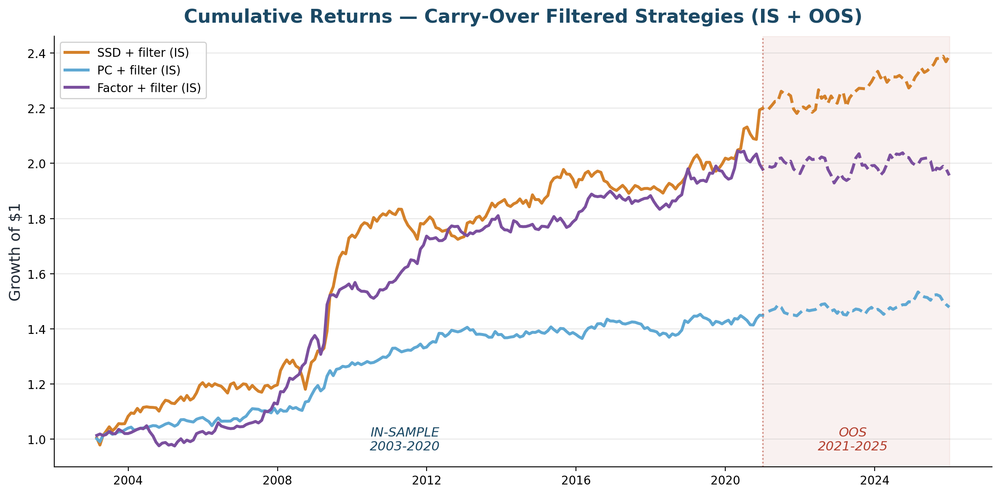

<span class="small">Solid = IS (2003–2020), dashed = OOS (2021–2025). All strategies use carry_over=True, max 3 months.</span>

---

## Year-by-year returns — carry-over strategies

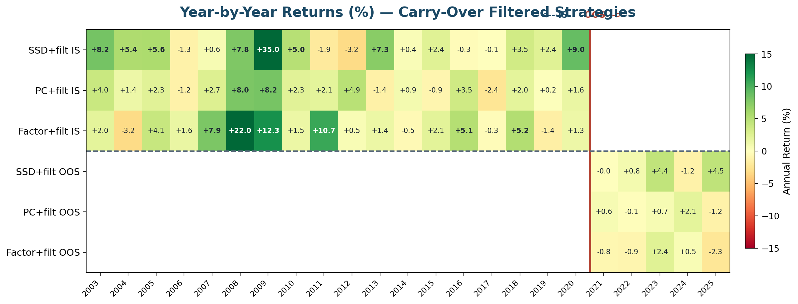

- **SSD + filter:** consistently positive across years, strong in GFC and OOS
- More time for reversion smooths out year-to-year variance for SSD
- PC and factor show more negative years when trades are held longer

---

## P&L breakdown — carry-over strategies (IS vs OOS)

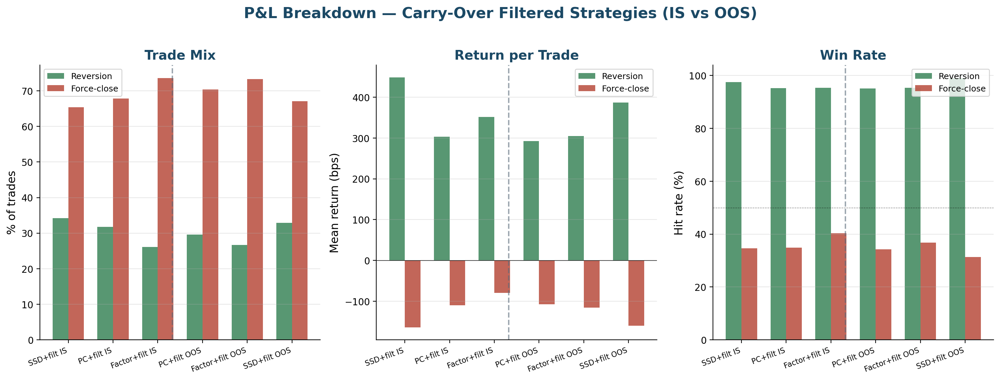

- **Higher reversion rate** — more trades complete their mean-reversion cycle
- **Fewer force-closes** — the drag that was killing profitability is reduced
- **Trade-off:** trades held longer carry more risk per position

---

## Carry-over key findings

**1. SSD + filter benefits most from carry-over**
- IS Sharpe 0.889 | OOS Sharpe 0.542
- SSD selects by price-path shape — when these pairs diverge, they genuinely need more time to converge

**2. PC + filter works better with force-close**
- IS Sharpe 0.736 | OOS Sharpe 0.183
- PC pairs selected by idiosyncratic correlation — when they haven't reverted by month-end, the correlation structure may have shifted. Cutting losses early is better.

**3. Factor-beta also prefers force-close**
- IS Sharpe 0.862 | OOS Sharpe -0.056
- Factor loadings shift over time — holding amplifies the mismatch

**Takeaway:** the optimal trade duration depends on the distance metric. SSD pairs revert slowly (price convergence); PC/factor pairs revert quickly or not at all.

---

## Engineering rigour

- **Modular package** — `distances · clustering · spread · cointegration · backtest · performance · costs · lookahead`, each independently unit-tested.
- **67 synthetic unit tests** across 11 files — validate every component on data with a *known* answer before touching real CRSP.
- **6/6 lookahead audit PASS** — black-box test confirms no future information leakage.
- **Look-ahead protection** baked into the z-score and the rolling formation/trading split.
- **Reproducible** — config-driven single source of truth; hyperparameters frozen pre-results to prevent overfitting.

<span class="small">Stack: Python · pandas · NumPy · scikit-learn (OPTICS) · statsmodels (ADF / OLS) · matplotlib · parquet.</span>

---

## What this demonstrates

- **Independent replication** of a 2025 research paper — read it, rebuilt it, matched the headline number on data we sourced ourselves.
- **Honest validation** — 5-year OOS test shows the strategy survives but with regime-dependent decay. We report what we found, not what we hoped.
- **Quant intuition** — diagnosed *why* the strategy makes money, then engineered the fix.
- **Discipline** — survivorship-bias-free data, out-of-sample design, frozen hyperparameters, unit-tested code, implementation-correctness review.

---

<!-- _class: lead -->
<!-- _paginate: false -->

# Thank you

**Clustering-Based Pairs Trading**
IS Sharpe **1.113** · OOS Sharpe **0.412** · 274 months total · built from the data up

<span class="small">Happy to walk through the code, the backtest engine, or the attribution analysis.</span>
